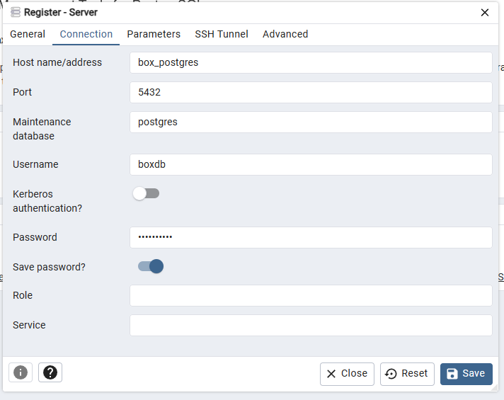

# Running

-   Make sure you have Docker installed and open.
-   Run `docker-compose up`.
-   Navigate to `http://localhost:8888`.
-   Login with container `box_pgadmin4` credentials from `docker-compose.yml` file.
-   Right click `Servers` -> `Register` -> `Server`.
-   Name can be whatever.
-   Connect with container `box_postgres` credentials from `docker-compose.yml` file.

### Connection page example

